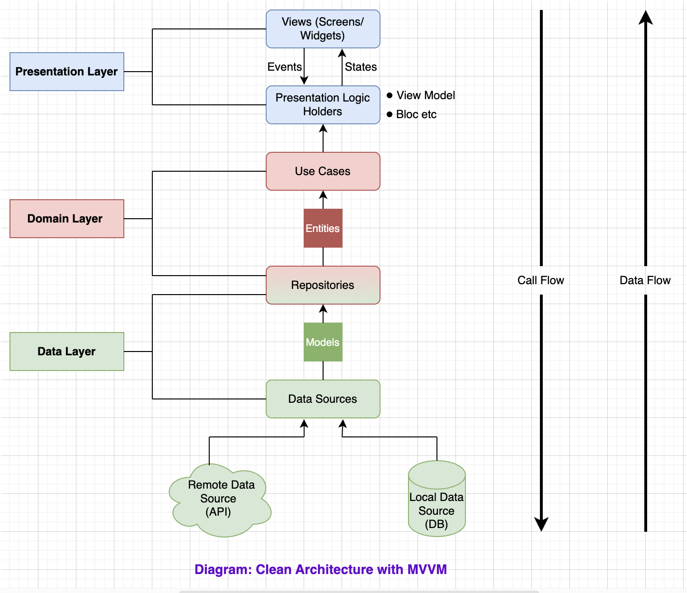
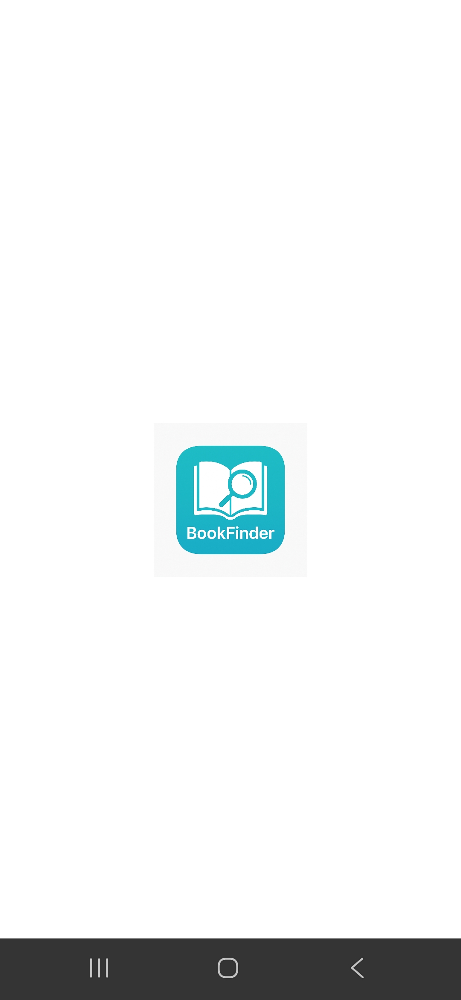
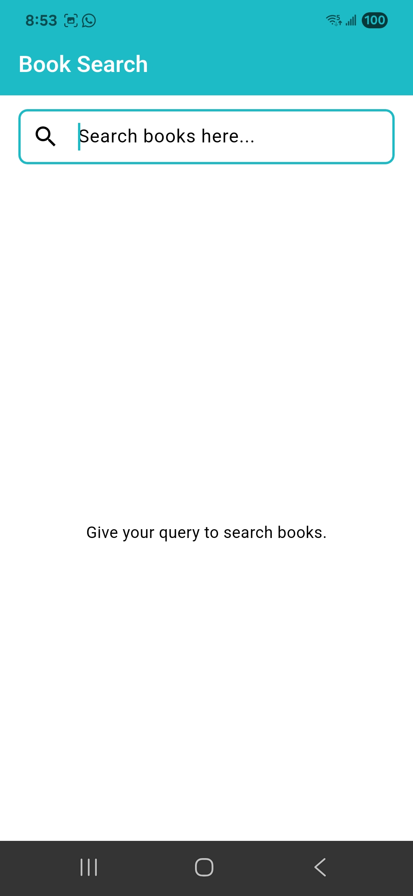

## backbase bookfinder

## Overview
This is a bookfinder app using openlibarayAPI.

## Project Goals

**Screens**

**1. BookSearch Screen** – We can search for books by entering a query in the search bar using the **OpenLibrary API**.

**2. Book Details Screen** – We can fetch book details by passing the OpenLibrary ID. **Offline support** is also available for this.

**Key functionalities**

**BookSearch Screen**
- **Search Bar** – We can enter our query. Based on that query, we fetch a list of books. Used **debounce** to avoid multiple API calls on every keypress.

- **Books List** – We request only required fields (title, author name, and thumbnail) to avoid extra data. While fetching data, used **shimmer animation** until the data is rendered. Implemented **pagination** and **pull-to-refresh** for loading and refreshing the data.

- **Pagination** – First, we get #page 1 with 20 items (this 20 is fixed and configurable in the constants file). On swipe-up, items will load continuously – #page 2, #page 3, and so on.

- **Pull-to-refresh** – When we swipe down, the page resets to 1 for updated records from the server.

**BookDetails Screen**

- When we click on a list item, we navigate to the book details page.

- In the book details, the title, author, and cover page with **rotation animation** are displayed (these details are passed from the list screen).

- Publisher name, publish date, and number of pages are fetched from the API by passing the OpenLibrary ID.

- **Offline Support** – First, we search the local database using the OpenLibrary ID as the primary key. If data exists in the database, we display it from there. Otherwise, we fetch from the API and save it in the local database.

## Architecture

The Project is Based on MVVM and Clean-Architecture with consideration of SOLID principles.

## Folder Structure

**Data:** The data layer serves as a bridge between the domain layer and the presentation layer, supplying data through implementations of data sources, repositories, and models.

**Domain:** The domain layer encapsulates the core business logic and rules, acting as an intermediary between the data layer and presentation layer to ensure separation of concerns and maintain a clean, business-centric architecture. 

**Presentation**: The presentation layer manages user interfaces and interactions, focusing on the visual representation of data and user experience. It relies on the domain layer for business logic and the data layer for data retrieval, fostering a clear separation of concerns in the application architecture.

## Libraries Used

- **Flutter**: Flutter is a UI toolkit that enables the creation of natively compiled applications for mobile, web, and desktop from a single codebase.
 
- **Retrofit and Dio** : for Networking.
- **Floor** : for Local Database.it is wrapper on SQLite.
- **Bloc** : for State Management.
- **GetIt** : Dependancy Injection.
- **Sizer** : for Responsive UI.
- **dartz** : for Folding.
- **mockito** : for UnittTesting.

### Author
 **Dalayya Kalla**
- **Email**: [dalu547@gmail.com]()
- **LinkedIn**: https://www.linkedin.com/in/dalu547/
- **Medium**: https://medium.com/@dalu547
- **Github** : https://github.com/dalu547
  

## App Screenshots

 
 

